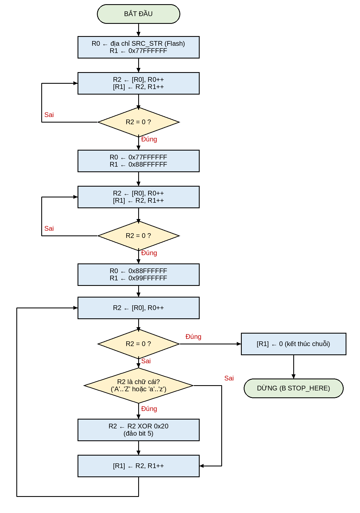

# Bài 2 – Hợp ngữ ARM: copy và đổi hoa/thường chuỗi "Hello World"

**Yêu cầu:** đặt chuỗi `"Hello World"` tại địa chỉ `0x77FFFFFF`, copy sang `0x88FFFFFF`, rồi đảo chữ hoa ↔ thường (`"hELLO wORLD"`) và lưu tại `0x99FFFFFF`.

| File | Nội dung |
|---|---|
| `bai2.s` | Chương trình hợp ngữ (ARM Compiler 5 / armasm, Cortex-M3) |
| `map_memory.ini` | Lệnh MAP cho phép Keil Simulator truy cập 3 vùng nhớ của đề bài |

## Thuật toán
1. Ghi chuỗi gốc vào `0x77FFFFFF`, từng byte cho tới ký tự `'\0'`.
2. **Copy:** đọc từng byte ở `0x77FFFFFF` (`LDRB … [R0], #1`) và ghi sang `0x88FFFFFF` (`STRB … [R1], #1`), dừng khi gặp `'\0'`.
3. **Đổi hoa/thường:** với mỗi byte ở `0x88FFFFFF`, nếu là chữ cái (`'A'..'Z'` hoặc `'a'..'z'`) thì đảo bit 5 (`EOR R2, R2, #0x20`), rồi ghi vào `0x99FFFFFF`.

## Chạy trên Keil µVision 5 (ARM Compiler 5)
> Lưu project ở đường dẫn **không dấu, không khoảng trắng**, ví dụ `D:\KTVXL\Bai2`.
1. *Project → New µVision Project…* → chọn chip **STM32F103C8**.
2. Ở cửa sổ *Manage Run-Time Environment*, tích **Device → Startup** (và **CMSIS → CORE**).
3. Thêm `bai2.s` vào *Source Group 1*.
4. *Options for Target → Debug* → chọn **Use Simulator**, ô *Initialization File* chọn `map_memory.ini`.
5. Build (F7) → *Debug → Start/Stop Debug Session* (Ctrl+F5) → Run (F5) → Stop.
6. Mở *View → Memory Windows → Memory 1*, gõ lần lượt `0x77FFFFFF`, `0x88FFFFFF`, `0x99FFFFFF` để xem kết quả.
