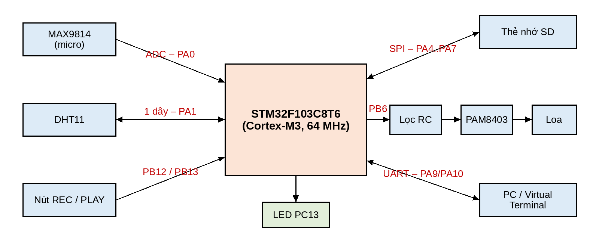
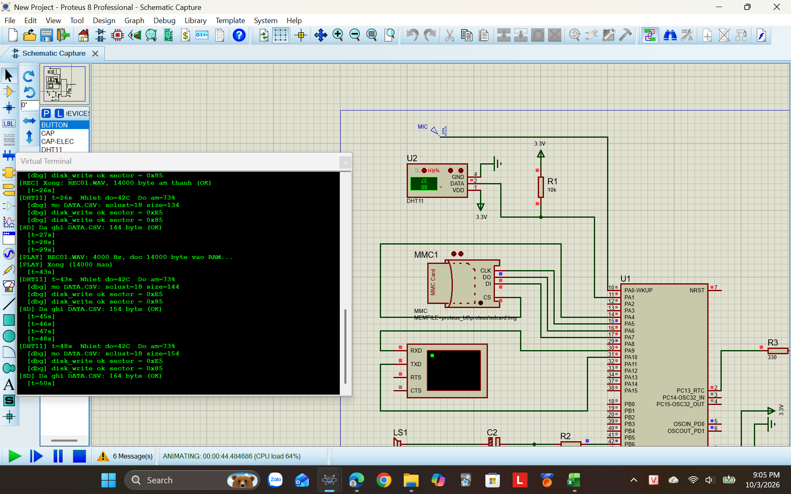

# BTL Kỹ thuật Vi xử lý (ELE1317) – PTIT

Bài tập lớn môn **Kỹ thuật vi xử lý**, Học viện Công nghệ Bưu chính Viễn thông.

| Thư mục | Nội dung |
|---|---|
| [`Bai1_STM32_SD_DHT11_Audio/`](Bai1_STM32_SD_DHT11_Audio) | **Bài 1:** STM32F103C8T6 + thẻ SD + DHT11 + ghi/phát âm thanh WAV (mã nguồn C, file hex, mô phỏng Proteus) |
| [`Bai2_ARM_Assembly/`](Bai2_ARM_Assembly) | **Bài 2:** hợp ngữ ARM: copy và đổi hoa/thường chuỗi "Hello World" (Keil) |
| [`BaoCao/`](BaoCao) | Báo cáo Bài 1 (Word + PDF) |
| [`LinhKien/`](LinhKien) | Danh sách linh kiện kèm ảnh |

## Bài 1 – Đề bài
- **a)** STM32F103C8T6 + module SD + DHT11: cứ **5 giây** ghi nhiệt độ, độ ẩm vào thẻ (`DATA.CSV`), kiểm tra bằng đầu đọc thẻ USB.
- **b)** MAX9814 → ADC: ghi âm giọng nói thành file **.WAV** trên thẻ SD.
- **c)** Mạch loa: phát lại file WAV từ thẻ SD.

### Sơ đồ chân
| Chân | Kết nối |
|---|---|
| PA0 | MAX9814 OUT (ADC1_IN0) |
| PA1 | DHT11 DATA (kéo lên 10 kΩ, TIM2_CH2 Input Capture) |
| PA4 / PA5 / PA6 / PA7 | SD: CS / SCK / MISO / MOSI |
| PA9 / PA10 | UART TX / RX, 115200 baud |
| PB6 | PWM (TIM4_CH1) → 1 kΩ → 100 nF xuống GND → 10 µF → PAM8403 / loa |
| PB12 / PB13 | Nút REC / PLAY (nối GND) |
| PC13 | LED trạng thái |



### Kết quả mô phỏng Proteus


### Chạy mô phỏng
1. Nạp `hex/btl_ktvxl_PROTEUS.hex` vào STM32F103C8 (Program File), tần số 64 MHz.
2. MMC: *Card Image File* = `proteus/sdcard.img`. Nguồn tín hiệu MIC = `proteus/mic_input.wav`.
3. Virtual Terminal 115200 baud → chạy ▶, chỉnh DHT11 bằng nút ▲/▼, bấm PB12 để ghi âm, PB13 để phát.
4. Dừng mô phỏng, mở `sdcard.img` bằng **7-Zip** để lấy `DATA.CSV` và `REC01.WAV`.

Mạch thật: nạp `hex/btl_ktvxl_MACH_THAT.hex` bằng ST-Link (8 kHz, 5 giây ghi âm). Các điểm phải sửa riêng cho Proteus xem trong [`GHI_CHU_KY_THUAT.md`](Bai1_STM32_SD_DHT11_Audio/GHI_CHU_KY_THUAT.md).

### Biên dịch lại
```bash
cd Bai1_STM32_SD_DHT11_Audio/firmware
make CFLAGS="-mcpu=cortex-m3 -mthumb -Os -Wall -ffunction-sections -fdata-sections -Ifatfs -I. -DPROTEUS"  # bản Proteus
make clean && make                                                                                       # bản mạch thật
```
Cần `arm-none-eabi-gcc`. Thư viện FatFs R0.11 © ChaN.
